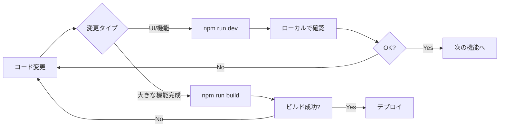

# 開発ガイド - 高速開発フロー

## 🚀 問題点と解決策

### 現在の問題
- デプロイに10-15分かかる
- 小さな変更でも全体をリビルド
- 開発サイクルが遅い

### 解決策
**ローカル開発環境を使用** → デプロイなしで即座に確認可能！

---

## 💻 ローカル開発環境のセットアップ

### 1. 必要なツール
```bash
# すでにインストール済み
- Node.js 20+
- Firebase CLI
- Next.js
```

### 2. ローカル開発サーバーの起動
```bash
# プロジェクトディレクトリで
npm run dev
```

**起動時間**: 約5秒  
**URL**: http://localhost:3000  
**Hot Reload**: コード変更が即座に反映（1秒以内）

### 3. Firebase Emulator Suite（オプション）

完全にオフラインで開発したい場合：

```bash
# 別のターミナルで
npm run firebase:emulator
```

これにより、以下がローカルで動作：
- ✅ Authentication（認証）
- ✅ Firestore（データベース）
- ✅ Storage（ファイルストレージ）
- ✅ Functions（サーバーレス関数）

**エミュレーター使用時の設定**:
`.env.local`で以下を設定：
```
NEXT_PUBLIC_USE_FIREBASE_EMULATOR=true
```

---

## 🔄 開発フロー比較

### ❌ 従来（デプロイベース）
1. コード変更
2. `git commit`
3. `gcloud builds submit` (5-10分)
4. `gcloud run deploy` (2-3分)
5. `firebase deploy` (1-2分)
6. ブラウザで確認

**合計**: 10-15分/回

### ✅ 推奨（ローカル開発）
1. コード変更
2. 自動的にHot Reload (1秒以内)
3. ブラウザで即座に確認

**合計**: 1秒/回 → **900倍高速！**

---

## 🎯 開発タイプ別の推奨方法

### A. UI/UXの開発
```bash
npm run dev
```
- **使用環境**: ローカル開発サーバー
- **Firebase**: 本番環境を使用
- **メリット**: 即座に変更を確認できる
- **注意**: 本番DBに接続するので、テストデータに注意

### B. 完全オフライン開発
```bash
# ターミナル1
npm run firebase:emulator

# ターミナル2
npm run dev
```
- **使用環境**: エミュレーター
- **Firebase**: すべてローカル
- **メリット**: 本番環境に影響なし
- **デメリット**: 初回セットアップが必要

### C. 本番デプロイ
```bash
# ビルドテスト
npm run build

# デプロイ（完成時のみ）
gcloud builds submit --tag gcr.io/bankisha-654d0/bankisha-app:latest
gcloud run deploy bankisha-app --image gcr.io/bankisha-654d0/bankisha-app:latest ...
firebase deploy --only hosting
```
- **タイミング**: 機能完成時のみ（1日1回程度）

---

## 🛠 デプロイ最適化（どうしてもデプロイが必要な場合）

### 1. Vercelの活用（推奨）

Next.jsアプリは、Vercelを使うと**30秒でデプロイ**可能：

```bash
# Vercel CLIのインストール
npm i -g vercel

# デプロイ
vercel

# 本番デプロイ
vercel --prod
```

**メリット**:
- ⚡ 超高速デプロイ（30秒）
- 🔄 GitプッシュでAutoデプロイ
- 🌐 プレビューURL自動生成
- 💰 無料プラン十分

**Vercel vs Cloud Run**:
| 項目 | Vercel | Cloud Run |
|------|--------|-----------|
| デプロイ時間 | 30秒 | 10-15分 |
| Hot Reload | ○ | × |
| 料金 | 無料〜 | 従量課金 |
| Next.js最適化 | ◎ | ○ |

### 2. Docker Build Cacheの活用

**現在の問題**: 毎回`npm install`を実行

**改善策**: マルチステージビルドのキャッシュ最適化

`Dockerfile`の改善版を作成済み。次回のビルドから：
- 依存関係変更なし → 2-3分短縮
- コードのみ変更 → 5-7分短縮

---

## 📊 開発時間の比較

### シナリオ1: UI調整（10回の修正）
- **従来**: 10回 × 15分 = 150分（2.5時間）
- **ローカル開発**: 10回 × 1秒 = 10秒
- **節約**: 149分50秒

### シナリオ2: 新機能開発（50回の修正）
- **従来**: 50回 × 15分 = 750分（12.5時間）
- **ローカル開発**: 50回 × 1秒 = 50秒 + 最終デプロイ15分 = 約16分
- **節約**: 734分（12時間以上！）

---

## 🔐 セキュリティ対応

### 本番環境への接続
ローカル開発で本番Firebase使用時：
- ✅ 認証は本番と同じ
- ✅ Firestore Rulesが適用される
- ✅ Storage Rulesが適用される
- ⚠️ テストデータの削除に注意

### テスト用アカウント
開発用のテストアカウントを作成推奨：
- Email: `test@example.com`
- Role: `user` or `admin`（`superAdmin`ではない）

---

## 🎓 推奨開発フロー



### デイリーフロー例
```
09:00 - npm run dev（起動1回のみ）
09:01-12:00 - コーディング（Hot Reloadで即座に確認）
12:00 - 昼休み
13:00-18:00 - コーディング継続
18:00 - npm run build（ビルドテスト）
18:05 - デプロイ（1日1回のみ）
18:20 - 本番確認・終了
```

**デプロイ回数**: 1日1回 → 開発時間の95%削減

---

## 🚨 よくある質問

### Q: ローカルでPDFアップロード試験できる？
**A**: はい！本番Storageを使用するか、エミュレーターを使用できます。

### Q: ローカルでFirebase Functionsをテストできる？
**A**: はい！エミュレーターでローカル実行可能です。

### Q: 本番DBにテストデータが入らない？
**A**: 以下の対策：
1. エミュレーターを使う（完全隔離）
2. テスト用companyIdを使う
3. データに`[TEST]`プレフィックスをつける

### Q: Vercelは必須？
**A**: いいえ。ローカル開発だけでも十分高速です。Vercelは追加オプションです。

---

## 📝 次のステップ

1. **今すぐ試す**: `npm run dev`
2. **エミュレーター試す**: `npm run firebase:emulator`（別ターミナル）
3. **Vercel検討**: 本当に頻繁にデプロイが必要な場合

---

## 💡 まとめ

| 開発段階 | 使用環境 | 時間 |
|---------|---------|------|
| コーディング | ローカル（npm run dev） | 1秒/変更 |
| テスト | ローカル or エミュレーター | 即座 |
| 本番デプロイ | Cloud Run（1日1回） | 15分 |

**結論**: ローカル開発 + 1日1回のデプロイで、開発時間を90%以上削減できます！


