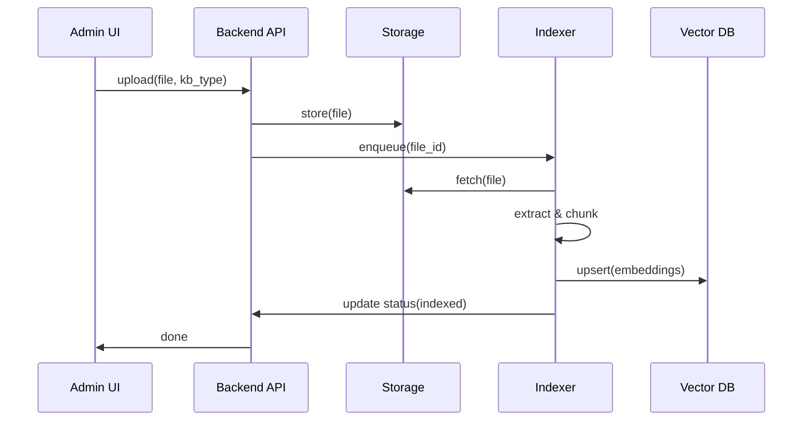
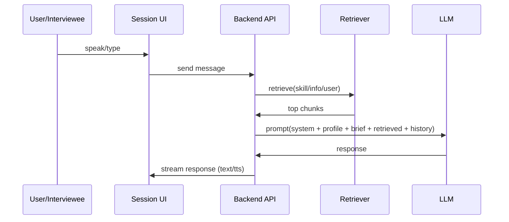

# AIインタビューアプリ 仕様書

> 目的：ビジネスメディア向けに「音声/テキストで取材できるAIインタビュアー」を提供する。AIは **3つのナレッジベース**（スキル/情報/ユーザー専用情報）と **ユーザーが設定したインタビュアー人格** を統合し、取材の質（深掘り・構造化・記事化適性）を高める。

---

## 1. 用語

- **スキルナレッジベース（Skill KB）**：インタビューの基礎知識（聞き方、深掘り、要約、沈黙、編集術など）。主にPDF。
- **情報ナレッジベース（Info KB）**：業界/専門知識（スタートアップ、金融、クリエイティブ、製造など）。主にPDF。
- **ユーザーナレッジベース（User KB）**：ユーザー専用の情報KB。ファイル上限10件。
- **スーパーアドミン（Super Admin）**：Skill KB / Info KB にファイルをアップロード・管理できる。
- **ユーザー（User）**：メディア関係者。User KBとインタビュアー設定、取材作成/実行/共有ができる。
- **インタビューイー（Interviewee）**：取材対象。共有URLから参加。
- **取材セッション（Session）**：音声/テキストで進行する対話セッション。
- **チューニング（Tuning）**：テスト取材後に、インタビュアー設定/質問方針/プロンプトを調整する工程。

---

## 2. 主要ゴール

1. **AIが聞き上手であること**：話しやすい空気を作り、深掘りしつつ中立性を保つ。
2. **事前素養の内在化**：Skill KBの内容を「解説せずに」会話アルゴリズムへ反映。
3. **理解度の向上**：Info KB / User KBで専門知識の穴を減らす。
4. **運用しやすい制作フロー**：テスト → チューニング → 共有URL発行 → 本番取材。
5. **マルチモーダル入力**：音声（推奨）、テキスト、ドキュメントアップロードをサポート。

---

## 3. ナレッジベース設計

### 3.1 KBの種類と権限

| KB | 内容 | 追加/更新権限 | 参照範囲 |
|---|---|---|---|
| Skill KB | インタビュー術/編集術 | Super Adminのみ | 全ユーザーのAIが参照 |
| Info KB | 業界/専門知識 | Super Adminのみ | 全ユーザーのAIが参照 |
| User KB | ユーザー固有の専門情報 | User（本人） | 当該ユーザーのAIのみ参照 |

### 3.2 保存仕様

- 受け入れ形式：PDF（優先）、テキスト、Markdown（任意）、Docx（任意）
- 最大ファイル数：
  - Skill KB：制限なし
  - Info KB：制限なし
  - User KB：制限なし
- ファイルメタデータ：
  - `file_id`, `kb_type`, `owner_user_id(任意)`, `title`, `source`, `uploaded_at`, `page_count`, `hash`, `status(indexing)`

### 3.3 インデキシング（RAG）方針

- PDF → テキスト抽出 → チャンク分割 → 埋め込み → ベクトルDBへ格納
- チャンク設計（推奨）：
  - 500〜1,000 tokens 程度
  - 見出し/章情報をメタに保持
- 検索戦略：
  - 取材の目的（タイトル/箇条書き要件/ゲスト属性）をクエリ拡張
  - KBごとの重み付け（例：Skill > User > Info）
  - 取得上限（例：合計 12チャンク、KB別に最大数を設定）

---

## 4. インタビュアー設計（人格と挙動）

### 4.1 ユーザーが設定できる項目

- 基本情報
  - 名前、所属、プロフィール
  - 写真（アバター）
- 話し方
  - 性別（任意）、話すスピード、口調（丁寧/フランクなど）
- プロンプト入力（上級者向け）
  - `role / style /禁則事項/出力フォーマット` など

> UIから変更できるナレッジは **User KBのみ**。Skill/InfoはSuper Adminが管理。

### 4.2 AIの内部実行モデル（思考プロセス仕様）

AIは毎ターン、以下の内部プロセスで応答を生成する（ユーザーには見せない）。

1. **状況理解**：直前発言を要約し、論点・感情・未回収情報を特定
2. **ゴール整合**：取材目的（ユーザー入力）に照らし、次の1問の狙いを決める
3. **RAG検索**：
   - Skill KB：会話技術（沈黙、深掘り、要約、反証、編集思考）
   - Info KB：業界文脈の理解補助
   - User KB：ユーザー固有の前提/背景/質問意図
4. **Skill Card適用**：Triggerに応じて最適な技法を選ぶ
5. **質問生成**：
   - 原則「質問1つ + 追い質問最大1つ」
   - 誘導を避け、具体化（いつ/どこで/誰が/何を/どれくらい/どう判断）へ
6. **安全・倫理チェック**：NG/オフレコ/個人情報/誹謗中傷/守秘に抵触しない
7. **出力整形**：承認→要約→質問 の順で自然文として出力

---

## 5. 取材フロー（ユーザー体験）

### 5.1 新規インタビュー作成

入力項目：
- タイトル
- 質問したい内容（箇条書き or 文章）
- 任意：ゲスト属性（肩書/業界/職種など）

ボタン：
- **インタビューを作成（テスト）**：ボイスチャットのテスト取材を開始

### 5.2 テスト取材 → チューニング

- 数往復の会話を行う
- チューニング可能な項目：
  - インタビュアー設定（口調、スピード、プロンプト）
  - 取材の狙い（深掘り優先/網羅優先/ストーリー優先等）
  - 質問リストの修正
  - User KBの追加/入替（上限10）

### 5.3 本番取材（共有URL）

ボタン：
- **取材URLを作成**：公開用URLを生成し、取材対象に共有

取材方法：
- 音声チャット（推奨）
- テキストチャット
- ドキュメントアップロード（取材対象も可）

---

## 6. システム構成（Cursor実装のための参照）

### 6.1 コンポーネント

- **Web App（Next.js等）**
  - 管理（Super Admin）
  - ユーザー設定（インタビュアー、User KB）
  - 取材作成/実行/共有
- **API（Node/Go/Python）**
  - 認証/認可、ファイル管理、RAG検索、会話セッション管理
- **RAG基盤**
  - オブジェクトストレージ（PDF保管）
  - ベクトルDB（チャンク埋め込み）
  - メタDB（Postgres等）
- **音声基盤**
  - STT（音声→テキスト）
  - TTS（テキスト→音声）
  - WebRTC/音声ストリーミング（任意）
- **LLM実行**
  - プロンプト合成（System/Developer/User）
  - ツール呼び出し（RAG検索、セッション保存、要約）

### 6.2 データモデル（最小）

- `users`：ユーザー、ロール（super_admin/user）
- `interviewer_profiles`：インタビュアー設定（user_id, name, bio, voice_style, prompt_override…）
- `kb_files`：ファイル管理（kb_type, owner_user_id, storage_url, status…）
- `kb_chunks`：ベクトルDB参照用メタ（file_id, chunk_id, header, page, embedding_id…）
- `interviews`：取材企画（title, brief, created_by, status…）
- `sessions`：テスト/本番（interview_id, mode(test/live), share_token, started_at…）
- `messages`：会話ログ（session_id, role, text, timestamps, stt_meta…）
- `uploads`：取材中アップロード資料（session_id, file_id, extracted_text…）

---

## 7. プロンプト合成仕様（重要）

### 7.1 System Prompt（固定）

- 「ビジネスメディアのAIインタビュアー」
- 「自薦→他薦」
- 「Skill Card」
- 「解説禁止」
- 「倫理・安全」

### 7.2 Context（毎回変わる）

- ユーザー設定（名前/口調/スピード/プロフィール）
- 取材企画（タイトル、狙い、質問したい内容）
- セッション状態（これまでの要約、未回収リスト）

### 7.3 RAG挿入（引用の扱い）

- Skill KB：引用は出さず「技法として内在化」
- Info/User KB：必要なら要約し、断定は避ける（確認質問で補強）
- 挿入フォーマット例（内部）：
  - `### Retrieved Context (Skill/Info/User)`
  - `- [KB_TYPE] [Title/Section] ... (short paraphrase)`

---

## 8. 画面/機能一覧（MVP）

### 8.1 Super Admin

- KB管理
  - Skill KB：アップロード/一覧/削除/再インデックス
  - Info KB：アップロード/一覧/削除/再インデックス

### 8.2 User

- User KB管理（10件）
  - アップロード/削除/置換/インデックス状態
- インタビュアー設定
  - プロフィール、口調、スピード、写真、プロンプト欄
- 取材作成
  - タイトル、質問意図入力
- 取材セッション（テスト）
  - 音声/テキスト
  - チューニング導線
- 取材URL発行（本番）
  - URL生成、期限/パスコード（任意）

### 8.3 Interviewee（共有URL）

- 参加（ブラウザ）
  - 音声 or テキスト
  - ドキュメントアップロード

---

## 9. 会話品質の評価（運用KPI）

- 深掘り率：抽象回答→具体の取得回数
- 構造化率：要約の正確性（ユーザー評価）
- PR突破度：同じ主張の反復回数が減る
- 完走率：取材目的の質問意図を回収できた割合
- 安全性：NG違反/個人情報露出/オフレコ違反がゼロ

---

## 10. シーケンス（Mermaid）

### 10.1 KBアップロード（Super Admin）

### 10.2 取材セッション（RAG + 応答）

---

## 11. MVPの受け入れ基準（Acceptance Criteria）

- Super AdminのみがSkill/Info KBへアップロードできる
- UserはUser KBへファイル数制限なしでアップロードできる
- Userはインタビュアー設定（プロフィール/口調/スピード/プロンプト）を保存できる
- 取材作成→テスト取材→チューニング→取材URL発行→本番取材、が一連で動作する
- 本番取材は「音声（推奨）/テキスト/ドキュメントアップロード」に対応
- AIは毎ターン「承認→要約→質問」の形式で、質問は原則1つ（最大2）
- ログ（messages）がセッション単位で保存される

---

## 12. 実装メモ（Cursor向け）

- RAGはまず「単純ベクトル検索 + KB別の上限」でMVP構築し、後からリランキング導入
- Skill KBは **引用表示しない** 方針（内在化）を守る
- 共有URLは `share_token` を用いた匿名参加 + 任意でパスコード
- 音声は、まずSTT/TTSの往復でも良い（WebRTCは拡張）

---

## 13. ファイル命名ルール（推奨）

- `spec_ai_interviewer_app.md`
- `spec_rag_kb.md`（分割する場合）
- `spec_voice_pipeline.md`（分割する場合）

---

以上
